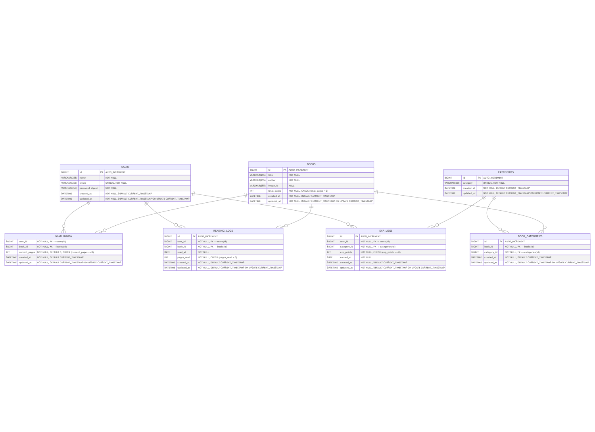

# テーブル設計
users
  - id           (BIGINT, PRIMARY KEY, AUTO_INCREMENT)
  - name         (VARCHAR(255), NOT NULL)
  - email        (VARCHAR(255), UNIQUE, NOT NULL)
  - password_digest (VARCHAR(255), NOT NULL)
  - created_at   (DATETIME, NOT NULL, DEFAULT CURRENT_TIMESTAMP)
  - updated_at   (DATETIME, NOT NULL, DEFAULT CURRENT_TIMESTAMP ON UPDATE CURRENT_TIMESTAMP)

categories
  - id           (BIGINT, PRIMARY KEY, AUTO_INCREMENT)
  - category     (VARCHAR(255), UNIQUE, NOT NULL)
  - created_at   (DATETIME, NOT NULL, DEFAULT CURRENT_TIMESTAMP)
  - updated_at   (DATETIME, NOT NULL, DEFAULT CURRENT_TIMESTAMP ON UPDATE CURRENT_TIMESTAMP)

books
  - id           (BIGINT, PRIMARY KEY, AUTO_INCREMENT)
  - title        (VARCHAR(255), NOT NULL)
  - author       (VARCHAR(255), NOT NULL)
  - image_id     (VARCHAR(255))  -- Active Storage 用
  - total_pages  (INT, NOT NULL, CHECK (total_pages > 0))
  - created_at   (DATETIME, NOT NULL, DEFAULT CURRENT_TIMESTAMP)
  - updated_at   (DATETIME, NOT NULL, DEFAULT CURRENT_TIMESTAMP ON UPDATE CURRENT_TIMESTAMP)

book_categories  -- books と categories の多対多関係を管理する中間テーブル
  - id           (BIGINT, PRIMARY KEY, AUTO_INCREMENT)
  - book_id      (BIGINT, NOT NULL, FOREIGN KEY → books(id))
  - category_id  (BIGINT, NOT NULL, FOREIGN KEY → categories(id))
  - created_at   (DATETIME, NOT NULL, DEFAULT CURRENT_TIMESTAMP)
  - updated_at   (DATETIME, NOT NULL, DEFAULT CURRENT_TIMESTAMP ON UPDATE CURRENT_TIMESTAMP)

user_books  -- ユーザーごとの読書状況を管理
  - user_id      (BIGINT, NOT NULL, FOREIGN KEY → users(id))
  - book_id      (BIGINT, NOT NULL, FOREIGN KEY → books(id))
  - current_pages (INT, NOT NULL, DEFAULT 0, CHECK (current_pages >= 0))
  - created_at   (DATETIME, NOT NULL, DEFAULT CURRENT_TIMESTAMP)
  - updated_at   (DATETIME, NOT NULL, DEFAULT CURRENT_TIMESTAMP ON UPDATE CURRENT_TIMESTAMP)

reading_logs  -- その日に読んだページ数を記録
  - id           (BIGINT, PRIMARY KEY, AUTO_INCREMENT)
  - user_id      (BIGINT, NOT NULL, FOREIGN KEY → users(id))
  - book_id      (BIGINT, NOT NULL, FOREIGN KEY → books(id))
  - read_at      (DATE, NOT NULL)
  - pages_read   (INT, NOT NULL, CHECK (pages_read > 0))
  - created_at   (DATETIME, NOT NULL, DEFAULT CURRENT_TIMESTAMP)
  - updated_at   (DATETIME, NOT NULL, DEFAULT CURRENT_TIMESTAMP ON UPDATE CURRENT_TIMESTAMP)

exp_logs  -- 獲得経験値の記録
  - id           (BIGINT, PRIMARY KEY, AUTO_INCREMENT)
  - user_id      (BIGINT, NOT NULL, FOREIGN KEY → users(id))
  - category_id  (BIGINT, NOT NULL, FOREIGN KEY → categories(id))
  - exp_points   (INT, NOT NULL, CHECK (exp_points >= 0))
  - earned_at    (DATE, NOT NULL)
  - created_at   (DATETIME, NOT NULL, DEFAULT CURRENT_TIMESTAMP)
  - updated_at   (DATETIME, NOT NULL, DEFAULT CURRENT_TIMESTAMP ON UPDATE CURRENT_TIMESTAMP)

https://mermaid.live/ で mermaid.txt を読み込ませ作成

